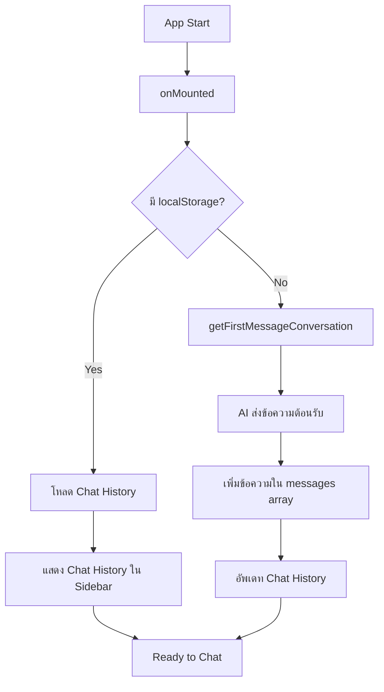
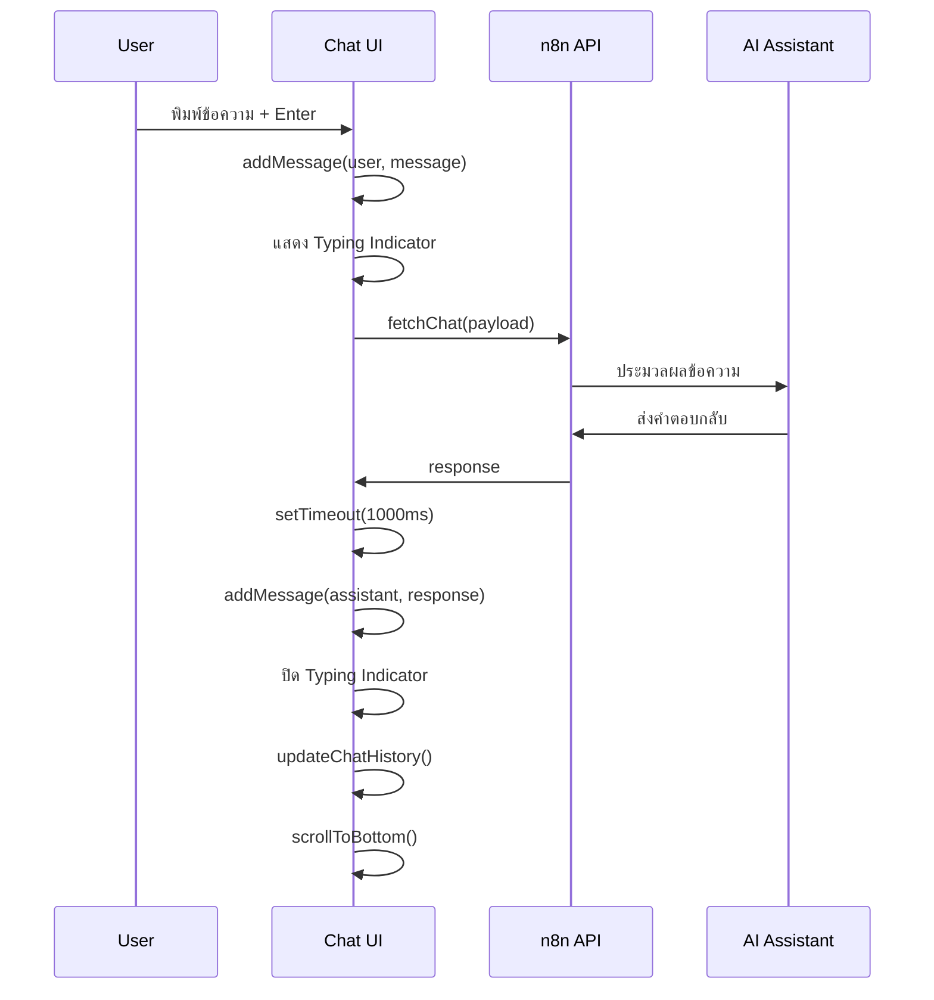
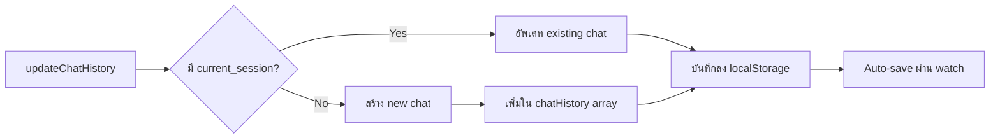
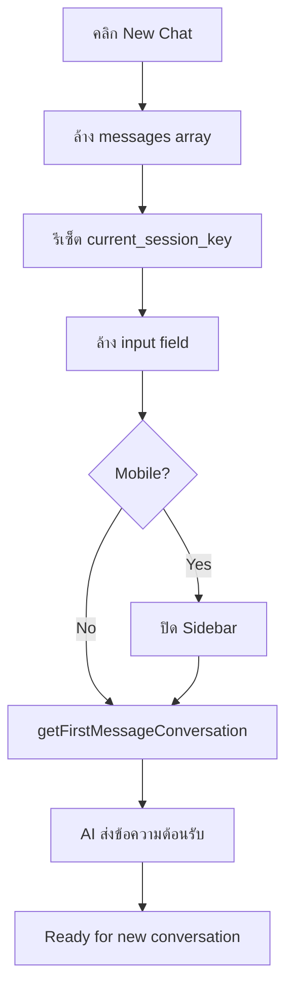
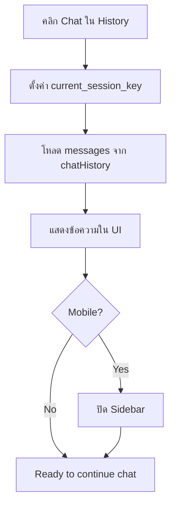

# 🤖 Kuddy AI Chat System - Flow Documentation

## 📋 Overview

**Kuddy AI Chat** เป็นระบบ Chat AI ที่พัฒนาด้วย **Nuxt 3 + Vue 3** พร้อม TypeScript สำหรับการสนทนากับ AI Assistant แบบ Real-time

---

## 🏗️ Architecture

### **Tech Stack**

- **Framework**: Nuxt 3 with TypeScript
- **UI Library**: Nuxt UI (Tailwind CSS)
- **State Management**: Vue 3 Composition API
- **Storage**: localStorage
- **Backend**: n8n Workflow API
- **Styling**: Tailwind CSS + Dark/Light Mode

### **Project Structure**

```
app/pages/chat.vue          # Main chat interface
├── Template (UI Layout)
├── Script Setup (Logic)
└── Styling (Tailwind CSS)
```

---

## 🎨 UI Components

### **1. Sidebar (Left Panel)**

- **Chat History List**: แสดงรายการ conversation ที่ผ่านมา
- **New Chat Button**: สร้าง chat session ใหม่
- **Dark/Light Mode Toggle**: เปลี่ยนธีม
- **Responsive Design**:
  - Desktop: ติดซ้ายแบบ fixed
  - Mobile: Overlay แบบ slide-in

### **2. Main Chat Area (Right Panel)**

- **Mobile Header**: แสดงเฉพาะบนมือถือ
- **Chat Messages Container**:
  - User messages (ขวา - สีน้ำเงิน)
  - AI messages (ซ้าย - พื้นหลังขาว/เทา)
  - Typing indicator
- **Input Area**: Text area + Send button

---

## 🔄 System Flow

### **1. เริ่มต้นระบบ (Application Startup)**



**Code Flow:**

```javascript
onMounted(async () => {
  const saved = localStorage.getItem("ai-chat-history");

  if (saved) {
    // โหลดและแปลง chat history
    chatHistory.value = JSON.parse(saved);
  } else {
    // เริ่มต้นด้วยข้อความจาก AI
    getFirstMessageConversation();
  }

  window.addEventListener("resize", handleResize);
});
```

### **2. การส่งข้อความ (Send Message Flow)**



**Code Implementation:**

```javascript
const sendMessage = async () => {
  const message = inputMessage.value.trim();
  if (!message || isTyping.value) return;

  // 1. เพิ่ม user message
  await addMessage("user", message);
  inputMessage.value = "";

  // 2. แสดง typing indicator
  isTyping.value = true;
  scrollToBottom();

  // 3. เรียก API
  const outputMessage = await fetchChat({
    user_id: channel.value.user_id,
    character_id: channel.value.character_id,
    session_key: channel.value.session_key,
    message: message,
  });

  // 4. แสดงคำตอบหลังจาก delay
  setTimeout(() => {
    addMessage({
      session_id: outputMessage.session_id,
      role: "assistant",
      content: outputMessage.content,
      created_at: outputMessage.created_at,
    });
    isTyping.value = false;
    updateChatHistory();
    scrollToBottom();
  }, 1000);
};
```

### **3. การจัดการ Chat History**



**Key Features:**

- **Title Generation**: ใช้ข้อความแรกของ conversation (50 ตัวอักษร)
- **Auto-save**: ใช้ Vue `watch` สำหรับบันทึกอัตโนมัติ
- **Session Management**: ติดตาม `current_session_key`

### **4. การเริ่ม Chat ใหม่ (New Chat)**



### **5. การเลือก Chat เก่า (Select Existing Chat)**



---

## 🔧 Key Features & Functions

### **API Integration**

```javascript
const fetchChat = async (payload) => {
  const n8nURL = runtimeConfig.public.n8nURL;
  const res = await $fetch(n8nURL, {
    method: "POST",
    body: {
      user_id: "bc8fd0be-0160-4b99-8d7c-8435282c6830",
      character_id: "c86f8fc1-3343-4c45-9483-5b6a5497cabd",
      session_key: "ses_Gin_ren_v1_ver_0",
      message: payload.message,
    },
  });

  return res;
};
```

### **Responsive Design**

- **Desktop**: Sidebar แสดงอยู่ตลอดเวลา
- **Mobile**: Sidebar แบบ overlay พร้อม backdrop
- **Auto-close**: ปิด sidebar อัตโนมัติหลังเลือก action บนมือถือ

### **UX Enhancements**

- ✅ **Typing Indicator**: จุดกระพริบแสดงสถานะ AI กำลังตอบ
- ✅ **Auto-scroll**: เลื่อนไปข้อความล่าสุดอัตโนมัติ
- ✅ **Markdown Support**: รองรับ **bold**, _italic_, `code`, `code blocks`
- ✅ **Keyboard Shortcuts**:
  - `Enter` = ส่งข้อความ
  - `Shift + Enter` = บรรทัดใหม่
- ✅ **Dark/Light Mode**: เปลี่ยนธีมได้
- ✅ **Timestamp**: แสดงเวลาของแต่ละข้อความ

### **Data Persistence**

```javascript
// Auto-save ทุกครั้งที่ chatHistory เปลี่ยน
watch(
  chatHistory,
  (newHistory) => {
    localStorage.setItem("ai-chat-history", JSON.stringify(newHistory));
  },
  { deep: true }
);

// โหลดข้อมูลตอน mount
const saved = localStorage.getItem("ai-chat-history");
if (saved) {
  chatHistory.value = JSON.parse(saved);
}
```

---

## 🎯 User Journey

### **💬 First Time User**

1. เข้าหน้า Chat → AI ส่งข้อความต้อนรับ
2. User พิมพ์คำถาม → AI ตอบ
3. ระบบสร้าง chat history อัตโนมัติ

### **🔄 Returning User**

1. เข้าหน้า Chat → โหลด chat history
2. เลือก chat เก่า หรือ สร้างใหม่
3. สนทนาต่อได้ทันที

### **📱 Mobile Experience**

1. แตะ hamburger menu → เปิด sidebar
2. เลือก action → sidebar ปิดอัตโนมัติ
3. Focus กลับไปที่ chat area

---

## 🚀 Technical Highlights

### **Performance Optimizations**

- **Lazy Loading**: ใช้ `ClientOnly` สำหรับ icons
- **Virtual Scrolling**: Auto-scroll อัจฉริยะ
- **Debounced Typing**: ป้องกัน multiple API calls

### **Error Handling**

- API Error handling ใน `fetchChat()`
- localStorage fallback กรณีข้อมูลเสียหาย
- Graceful degradation สำหรับ offline mode

### **Accessibility**

- Semantic HTML structure
- Keyboard navigation support
- Screen reader friendly
- High contrast mode support

---

## 📊 Data Structure

### **Message Object**

```typescript
interface Message {
  session_id: string;
  role: "user" | "assistant";
  content: string;
  created_at: Date;
}
```

### **Chat History Object**

```typescript
interface ChatHistory {
  session_key: string;
  title: string;
  messages: Message[];
  created_at: Date;
  updated_at: Date;
}
```

### **Channel Configuration**

```typescript
interface Channel {
  user_id: string;
  character_id: string;
  session_key: string;
}
```

---

## 🔮 Future Enhancements

- [ ] **File Upload**: รองรับการส่งไฟล์
- [ ] **Voice Messages**: บันทึกเสียงและ Speech-to-Text
- [ ] **Message Reactions**: ปุ่ม like/dislike
- [ ] **Export Chat**: ส่งออกการสนทนาเป็น PDF/TXT
- [ ] **Multiple Characters**: เลือก AI personality ได้
- [ ] **Real-time Sync**: Sync ระหว่างอุปกรณ์
- [ ] **Message Search**: ค้นหาในประวัติการสนทนา

---

_📝 Documentation อัพเดทล่าสุด: August 8, 2025_
